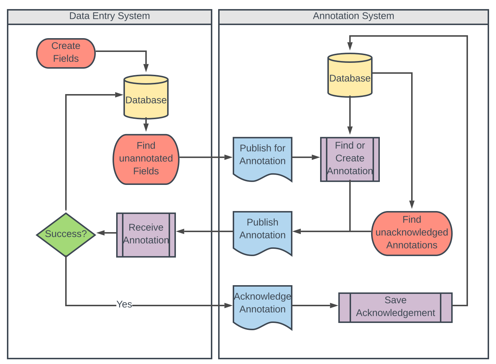

# Eventually
An exercise in eventual consistency.

The console app will setup both a data entry service and an annotation service. Inputs are set to define the number of data fields, and the rates of entry, retries, and failures.

In this case, we have a domain model of two distributed systems using a pub/sub model that ends with an ackowledgement.
# A data entry system that produces instances of a "First Class Field" type that require annotation by an external service
## This service will continually publish any "First Class Field" that does not yet have an annotation. We assume all fields require annotation.
# An annotation service that will attempt to find an existing annotation or generate one for a given field upon notification
## This service will publish annotations upon fetch/create events, as well as continually publish annotations that have not yet been acknowledged

The business goal is to **confidently** annotate all fields in the data entry service. Using a "fire-and-forget" delivery model, the program simulates failure at any of the communication points, and provides both an event-based integration as well as a state-based scheduled retry integration. We achieve the following goals:
# Limited afferent and efferent coupling between the two services
# No need to assume or even attempt to produce a *perfect* messaging technology
# A business-state based reconciliation between two systems that adheres to principles limited coupling

The model produces an eventually consistent result with a mathematical reliability within a certain range of tolerance. I haven't yet bothered to define the formula for that, but I am absolutely confident that it exists. Some of the timing and rates of state change grows unpredictable due to the number of concurrent Tasks and the program's inability to run as an actual distributed system. But, this is good enough for a demonstration of the principles.

